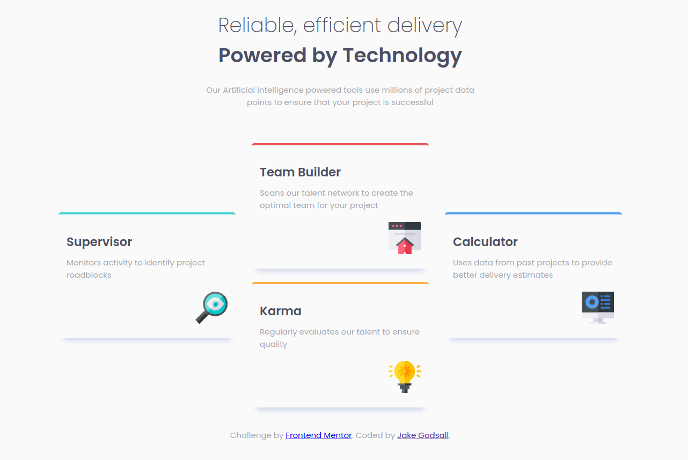

# Frontend Mentor - Four card feature section solution

This is a solution to the [Four card feature section challenge on Frontend Mentor](https://www.frontendmentor.io/challenges/four-card-feature-section-weK1eFYK). Frontend Mentor challenges help you improve your coding skills by building realistic projects. 

## Table of contents

- [Overview](#overview)
  - [The challenge](#the-challenge)
  - [Screenshot](#screenshot)
  - [Links](#links)
- [My process](#my-process)
  - [Built with](#built-with)
  - [What I learned](#what-i-learned)
  - [Continued development](#continued-development)
- [Author](#author)

**Note: Delete this note and update the table of contents based on what sections you keep.**

## Overview

### The challenge

Users should be able to:

- View the optimal layout for the site depending on their device's screen size

### Screenshot

Here is the finished desktop design for the project.



### Links

- Live Site URL: [Netlify](https://jakegodsall-four-card-feature.netlify.app)

## My process

### Built with

- Semantic HTML5 markup
- CSS custom properties
- Flexbox
- Mobile-first workflow


**Note: These are just examples. Delete this note and replace the list above with your own choices**

### What I learned

- How to add a `box-shadow` to just the bottom side of a div by using a `spread-radius` equal to the negative of the `blur-radius`: 

```css
box-shadow: offset-x, offset-y, blur-radius=value, spread-radius=-value, colour;
```

- How to more effectively judge sizes using Chrome dev tool's for rapid experimentation.


### Continued development

This is the first project on which I have gone _beyond_ the specification of the challenge, by adding another viewport layout (> 1600px). I shall continue to play around like this on the next challenges, as well as going back and adding more to previous challenges.

I feel I am now quite comfortable with the flexbox skills I know. As such, I shall learn a few more to start applying on the next project.

## Author

- Website - [Jake Godsall](https://jakegodsall.com)
- Frontend Mentor - [@jakegodsall](https://www.frontendmentor.io/profile/jakegodsall)
- LinkedIn - [@godsalljake](https://www.linkedin.com/in/godsalljake/)
