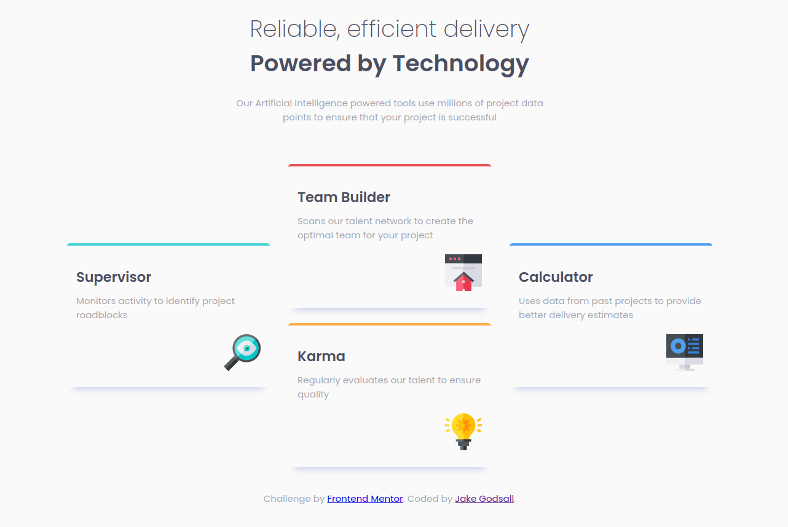

# Four card feature Section (Frontend Mentor)

This is a solution to the [Four card feature section challenge on Frontend Mentor](https://www.frontendmentor.io/challenges/four-card-feature-section-weK1eFYK). Frontend Mentor challenges help you improve your coding skills by building realistic projects.

## Overview

### The challenge

Users should be able to:

-   View the optimal layout for the site depending on their device's screen size

### Screenshot



### Links

-   Live Site URL: [Netlify](https://jakegodsall-four-card-feature.netlify.app/)

## My process

### Built with

-   Semantic HTML5 markup
-   CSS custom properties
-   Flexbox
-   Mobile-first workflow

### What I learned

-   How to add a `box-shadow` to just the bottom side of a div by using a `spread-radius` equal to the negative of the `blur-radius`:

```css
box-shadow: offset-x, offset-y, blur-radius=value, spread-radius=-value, colour;
```

-   How to more effectively judge sizes using Chrome dev tool's for rapid experimentation.

### Continued development

This is the first project on which I have gone _beyond_ the specification of the challenge, by adding another viewport layout (> 1600px). I shall continue to play around like this on the next challenges, as well as going back and adding more to previous challenges.

I feel I am now quite comfortable with the flexbox skills I know. As such, I shall learn a few more to start applying on the next project.

## Author

-   Website - [Jake Godsall](https://jakegodsall.com)
-   Frontend Mentor - [@jakegodsall](https://www.frontendmentor.io/profile/jakegodsall)
-   LinkedIn - [@godsalljake](https://www.linkedin.com/in/godsalljake/)

### Notes

This project was originally completed on 1st August 2022.

This repository is part of a series of repositories that have recently been cleaned and updated as part of an overhaul of my GitHub profile. The purpose of this overhaul was to ensure that each repository reflects my current development standards and practices, and to provide a cleaner, more professional appearance.

The project is updated as of 27th December 2023.

## License

This project is open source and available under the [MIT License](https://github.com/jakegodsall/fm-four-card-feature/blob/main/LICENSE).
